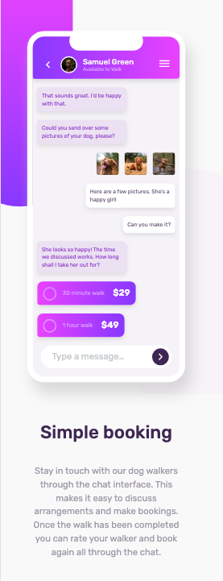

# ChatApp - Responsive Web Design Project

## 目錄

- [總覽](#總覽)
  - [專案介紹](#專案介紹)
  - [線上預覽](#線上預覽)
  - [成品預覽](#成品預覽)
- [開發過程](#開發過程)
  - [使用技術](#使用技術)
  - [我學到的內容](#我學到的內容)
  - [持續精進](#持續精進)
  - [實用資源](#實用資源)

## 總覽

### 專案介紹

這個專案採用了響應式網頁設計（RWD），支援電腦版和移動設備版。請調整瀏覽器的螢幕寬度來檢視不同的版型：

- 電腦版（> 768 px）
- 移動設備版（< 768 px，包括手機和平板）

這個專案使用 SCSS ＋ HTML 進行撰寫，並遵守 BEM 命名原則

#### [線上預覽](https://jess99978.github.io/chat-app-css-illustration-master/)

### 成品預覽

#### 電腦版預覽圖

#### 移動設備預覽圖

## 開發過程

### 使用技術

- BEM：使用 BEM（Block,Element,Modifier）命名規範來設計 HTML 的 class
- SCSS： 使用 SCSS 的模組化（import）、變數、巢狀結構、mixins
- 響應式網頁設計（RWD）：採用響應式網頁設計，使網頁能夠適應不同設備和螢幕尺寸，包括電腦和移動設備
- Flexbox：使用 Flexbox 進行頁面佈局
- Git 版本控制

### 我學到的內容

- 練習自定義 svg 圖檔樣式
- 嘗試加入 fav-icon
- 更加熟悉 CSS 的漸層(linear-gradient)、圓角(border-radius)的使用
- 引入 cdn 的 normalize.css 來標準化瀏覽器預設樣式
- 練習用 SCSS 的 mixin 和 include 來簡化重複樣式，例如 flex 的定義和兩種對話框的重複樣式

### 持續精進

- 為網站加入互動效果

### 實用資源

- [svg 免費資源](https://www.svgrepo.com/) -  提供大量 SVG 圖檔，可在線調整大小、間距和顏色，並一鍵複製 SVG 代碼使用。
- [設計漸層效果的網站](https://cssgradient.io/) - 直觀的漸層設計工具，可即時預覽調整漸層的顏色和斷點，並一鍵複製 CSS 代碼。
